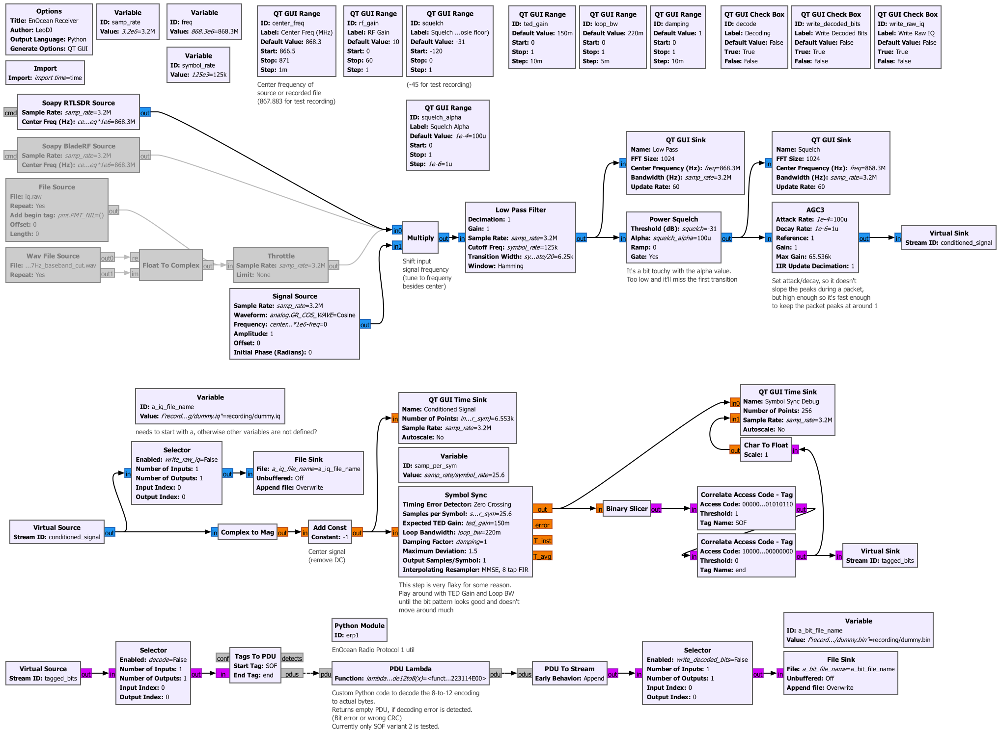
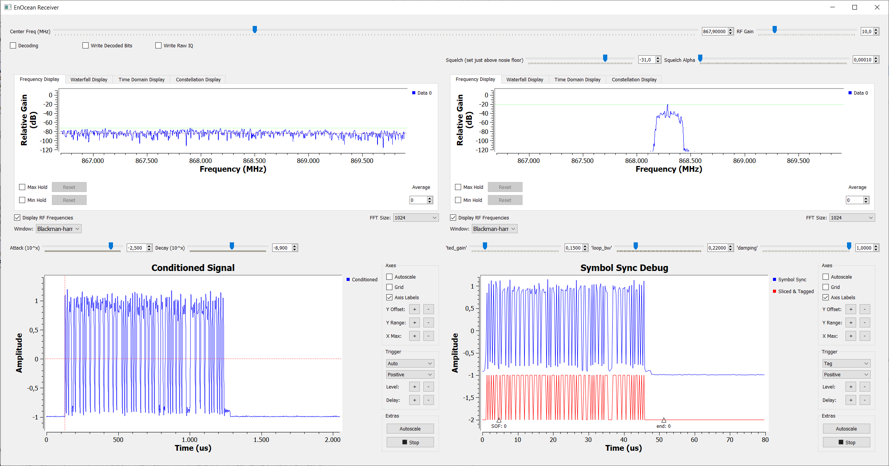

# GNU Radio Decoder for EnOcean Radio Protocol 1

This is a rudimentary decoder for EnOcean ERP1 made in GNU Radio.  

The 125 kbps ASK demodulation was a bit of a challenge and can probably be improved upon.  
The decoding of the demodulated bitstream is done in a python module block (including CRC check).

## Instructions
1. Setup input source in flow graph
1. Run flow graph
1. Set squelch slider so low that it lets everything pass and then a few dB higher (so only actual transmissions get through)
1. Set Attack and Gain sliders so the conditioned signal looks like in the screenshot below (the defaults might be ok, idk)
1. Play around with TED Gain and Loop BW, if the blue line in "Symbol Sync Debug" jumps around a lot or doesn't get a sync at all
1. Then activate the Decoding Checkbox (and optionally "Write Decoded Bits")
1. The decoding result get printed to the GNU Radio console

### Flow Graph

### GUI

## Notes
- The "recording" folder needs to exist, otherwise it wont't run.
- It will always create two "dummy" recording files. I didn't find a way to inhibit the creation of files dynamically at runtime.

### Resources
- ERP1 Protocol Spec: https://www.enocean.com/wp-content/uploads/support/download/EnOceanRadioProtocol1.pdf